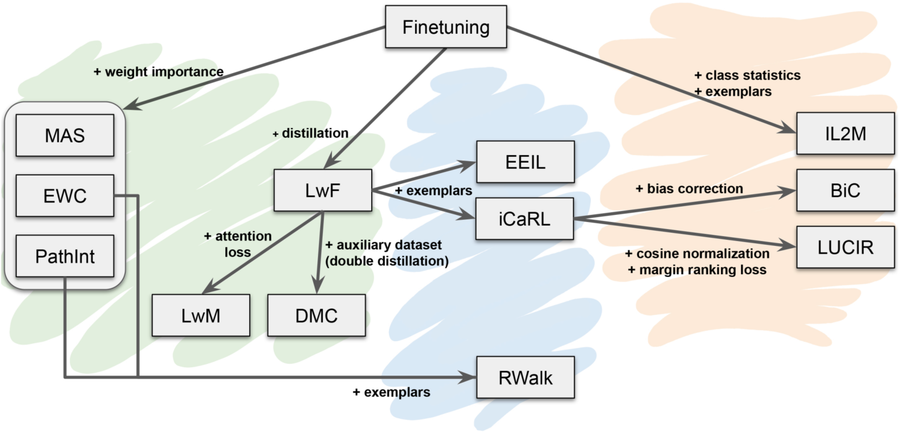

# Framework for Analysis of Class-Incremental Learning
Run the code with:
```
python3 -u src/main_incremental.py
```
followed by general options:

* `--gpu`: index of GPU to run the experiment on (default=0)
* `--results-path`: path where results are stored (default='../results')
* `--exp-name`: experiment name (default=None)
* `--seed`: random seed (default=0)
* `--save-models`: save trained models (default=False)
* `--last-layer-analysis`: plot last layer analysis (default=False)
* `--no-cudnn-deterministic`: disable CUDNN deterministic (default=False)

and specific options for each of the code parts (corresponding to folders):
  
* `--approach`: learning approach used (default='finetuning') [[more](approach)]
* `--datasets`: dataset or datasets used (default=['cifar100']) [[more](datasets)]
* `--network`: network architecture used (default='resnet32') [[more](networks)]
* `--log`: loggers used (default='disk') [[more](loggers/README.md)]

go to each of their respective readme to see all available options for each of them.

## Approaches
Initially, the approaches included in the framework correspond to the ones presented in
_**Class-incremental learning: survey and performance evaluation**_ (preprint , 2020). The regularization-based
approaches are EWC, MAS, PathInt, LwF, LwM and DMC (green). The rehearsal approaches are iCaRL, EEIL and RWalk (blue).
The bias-correction approaches are IL2M, BiC and LUCIR (orange).



More approaches will be included in the future. To learn more about them refer to the readme in
[src/approach](approaches).

## Datasets
To learn about the dataset management refer to the readme in [src/datasets](datasets).

## Networks
To learn about the different torchvision and custom networks refer to the readme in [src/networks](networks).

## GridSearch
We implement the option to use a realistic grid search for hyperparameters which only takes into account the task at
hand, without access to previous or future information not available in the incremental learning scenario. It
corresponds to the one introduced in _**Class-incremental learning: survey and performance evaluation**_. The GridSearch
can be applied by using:

* `--gridsearch-tasks`: number of tasks to apply GridSearch (-1: all tasks) (default=-1)

which we recommend to set to the total number of tasks of the experiment for a more realistic setting of the correct 
learning rate and possible forgetting-intransigence trade-off. However, since this has a considerable extra 
computational cost, it can also be set to the first 3 tasks, which would fix those hyperparameters for the remaining 
tasks. Other GridSearch options include:

* `--gridsearch-config`: configuration file for GridSearch options (default='gridsearch_config') [[more](gridsearch_config.py)]
* `--gridsearch-acc-drop-thr`: GridSearch accuracy drop threshold (default=0.2)
* `--gridsearch-hparam-decay`:  GridSearch hyperparameter decay (default=0.5)
* `--gridsearch-max-num-searches`: GridSearch maximum number of hyperparameter search (default=7)

## Utils
We have some utility functions added into `utils.py`.
